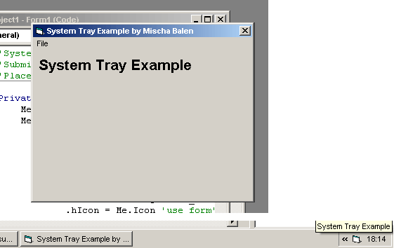



## A System Tray Demo

### Description

Learn how to send your application to the system tray and produce events when its icon is clicked, etc. Good for beginners.
 
### More Info
 

             |
---                |---
**Submitted On**   |2002-08-23 18:17:42
**By**             |[boltfishy](https://github.com/Planet-Source-Code/PSCIndex/blob/master/ByAuthor/boltfishy.md)
**Level**          |Beginner
**User Rating**    |4.8 (86 globes from 18 users)
**Compatibility**  |VB 5\.0, VB 6\.0
**Category**       |[Coding Standards](https://github.com/Planet-Source-Code/PSCIndex/blob/master/ByCategory/coding-standards__1-43.md)
**World**          |[Visual Basic](https://github.com/Planet-Source-Code/PSCIndex/blob/master/ByWorld/visual-basic.md)
**Archive File**   |[A\_System\_T1217118232002\.zip](https://github.com/Planet-Source-Code/boltfishy-a-system-tray-demo__1-38221/archive/master.zip)

